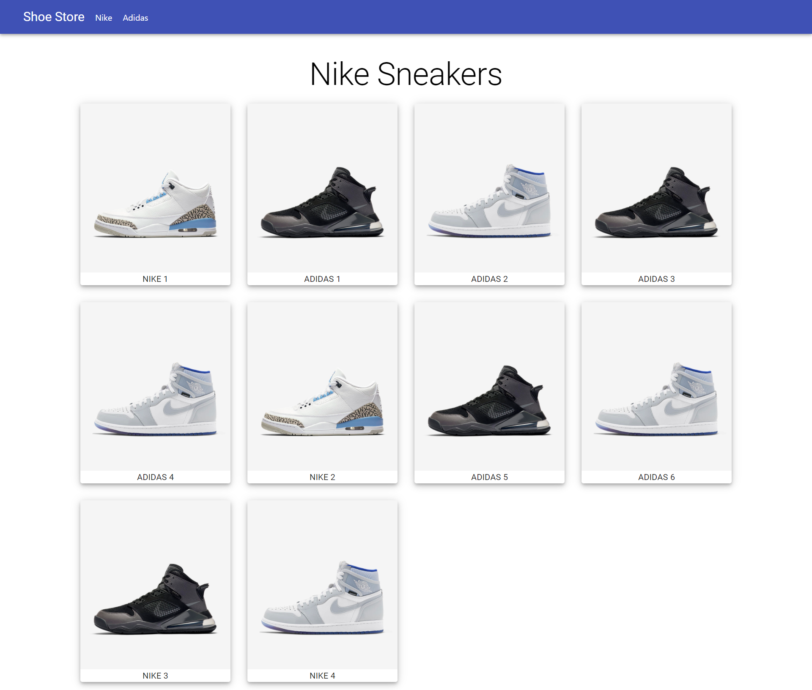

# This is a simple shoe store in which routing is implemented

### To access this app click :

http://store-shoe.surge.sh/

# 👨‍💻 React Shoe Store App.
## 📽 A project based on Panacloud React Bootcamp [Project 3].

### ⚒ Project Demo:
####  For Project Demo Follow the Link: http://store-shoe.surge.sh/

### 🕵️‍♂️ Project Details:
####  This project is based on primarily on React as well as uses other libraries too. In this app you see shoes and their prices.

### ⚙ Technical Details:
#### In this project, React is used for the project. Other Libraries used includes Material-UI and React-Router.

### 🤹‍♂️ Skill:
&nbsp;&nbsp;&nbsp;&nbsp;
&nbsp;&nbsp;&nbsp;&nbsp;
&nbsp;&nbsp;&nbsp;&nbsp;
&nbsp;&nbsp;&nbsp;&nbsp;

### ✔ Contributers:

  <a href="https://github.com/faraasat">
    &nbsp&nbsp&nbsp&nbsp&nbsp&nbsp&nbsp&nbsp&nbsp&nbsp&nbsp&nbsp
  </a>

### 📷 Project UI:

  <a href="http://store-shoe.surge.sh/">
    &nbsp&nbsp&nbsp&nbsp&nbsp&nbsp&nbsp&nbsp&nbsp&nbsp&nbsp&nbsp
  </a>

